# VORLAN

**A self-hosted NAS and home-server dashboard that works without the internet.**

VORLAN runs on your own machine: sign-in, file storage, a private vault, system monitoring and even the AI assistant (a local [Ollama](https://ollama.com) model) all work offline. Sign in once on your PC, then open the same VORLAN from your phone, tablet or any other device on your network.

Administrators get a desktop of windows for running the box (accounts, devices, live and 30-day charts, storage, tasks, logs, network, support). Everyone else gets a calm, fast app for their files, notes, pictures, music and assistant, and phones and tablets get a touch-first dashboard of their own.

<p align="center">
  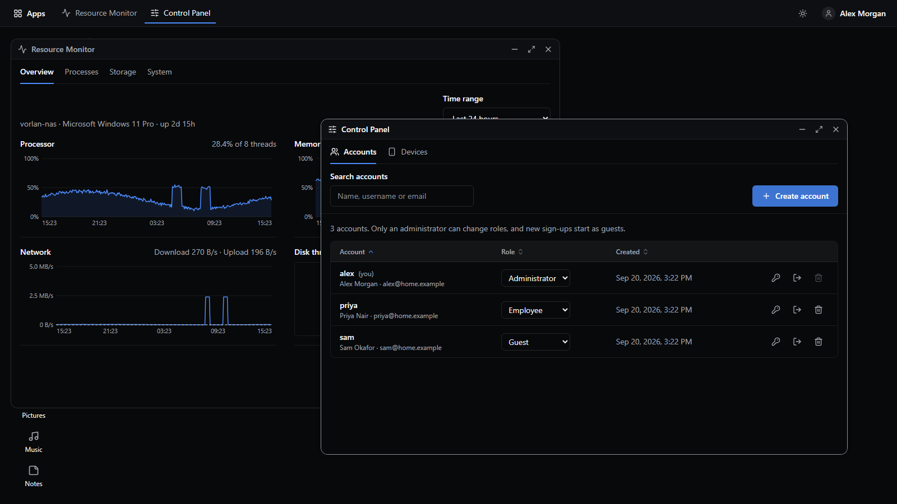
</p>

---

## Contents

- [What's new](#whats-new)
- [A tour](#a-tour)
- [Features](#features)
- [Security](#security)
- [Install on Linux](#install-on-linux)
- [Getting started (development)](#getting-started-development)
- [Configuration](#configuration)
- [Tech stack](#tech-stack)
- [Project structure](#project-structure)
- [Roadmap](#roadmap)

---

## What's new

VORLAN began as a sidebar with four pages. It has since been rebuilt in four steps, each of them a push to `main`:

| Step | What it brought |
|---|---|
| **1. Backend foundation** | SQLite replaces the JSON files. Roles, an admin API, an audit log, a job queue, an event bus and a metrics sampler. |
| **2. Original dashboard kept for touch devices** | The dashboard people already knew (wallpaper, big clock, coloured tiles) is preserved for phones and tablets. |
| **3. New design system, admin desktop and new UI** | One flat, accessible design system. A windowed desktop for administrators. Every user page redesigned. |
| **4. Security hardening** (latest) | HTTPS by default, a private per-install signing key, revocable sessions you can end from any device, brute-force limits, and files that finally require a sign-in. |

### 1. Backend foundation

- **SQLite data layer.** Profiles, devices, AI history, notes and vault PINs moved from JSON files into one database. A one-time migration runs on first start and leaves your old JSON files in place.
- **Roles.** The first account on a new install becomes the administrator; later sign-ups start as guests, and only an administrator can promote anyone. Administrators can create accounts, reset passwords, change roles and delete accounts (blocked for yourself and for the last administrator).
- **Live role checks.** A deleted or demoted account loses access on its next request, not when its token runs out.
- **Audit log** with categories, text search and paging. Every sign-in, failed sign-in, role change, password reset and failed task is recorded.
- **Event bus and job queue.** File copies now run as tracked tasks. Device activity, request statistics and failed-task auditing are listeners on the bus rather than code inside the auth middleware.
- **Metrics sampler.** A live in-memory buffer plus per-minute roll-ups kept for 30 days.
- **Admin reports.** System info, processes, storage, services, network, an *about* page and a diagnostics bundle that contains no passwords or keys.
- Errors without a status are answered generically, so file paths are never leaked to the browser.

### 2. The original dashboard, kept for phones and tablets

Non-admin accounts on a touch device (or a window narrower than 1024 px) are sent to the original dashboard, kept in `frontend/src/legacy`. It shares only the data layer with the new UI. Administrators always get the desktop.

### 3. Design system, admin desktop and new UI

- **One design system.** Semantic colour tokens at WCAG AA contrast, one small radius scale, borders instead of shadows, opacity-only motion. Built to be keyboard-first, with real loading, empty and error states everywhere.
- **Administrator desktop.** A window manager (drag, resize, minimise, maximise, keyboard move and resize, layouts remembered per user, full-screen windows on phones) hosting the admin apps and the user apps side by side.
- **New user experience.** A shared top bar (wordmark, Apps menu, breadcrumb, theme toggle, account menu) and redesigned pages for sign-in, home, Files, Pictures, Music, Notes, Personal Vault, Assistant, Cameras and Settings.
- **Safer everyday actions.** Deleting always asks first, the vault PIN is a single labelled field, and note previews no longer inject raw HTML.

### 4. Security hardening

See [Security](#security) for the details. In short: HTTPS by default; a private signing key generated for each install; 15-minute access tokens that renew quietly; a session per device that you (or an administrator) can end; wrong-password and wrong-PIN limits; and shared files, downloads and the Personal Vault served only to signed-in people. It also closes several holes found along the way, including unauthenticated `/media` and vault routes, wide-open CORS and a path-traversal in the delete routes.

---

## A tour

### The administrator desktop

Administrators land on a desktop. Every tool is a window: open several, arrange them, and the layout is remembered next time.

<table>
  <tr>
    <td width="50%">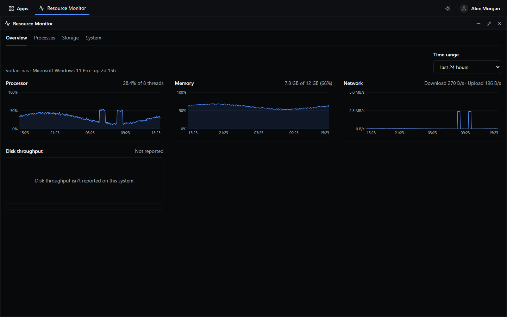<br><b>Resource Monitor.</b> Live charts for processor, memory, network and disk, or the last hour, 6 hours, 24 hours, 7 days or 30 days. Readable with the keyboard, with a spoken summary for screen readers.</td>
    <td width="50%">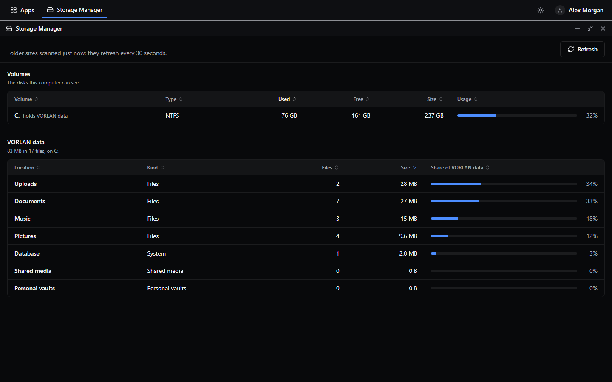<br><b>Storage Manager.</b> Every volume the computer can see, and how much of VORLAN's data lives in Documents, Uploads, Pictures, Music, shared media, personal vaults and the database.</td>
  </tr>
  <tr>
    <td width="50%">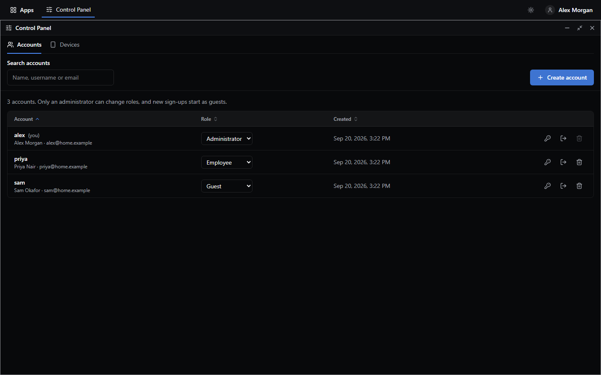<br><b>Control Panel: accounts.</b> Create accounts, change roles, reset passwords, sign an account out everywhere, or delete it with a typed confirmation.</td>
    <td width="50%">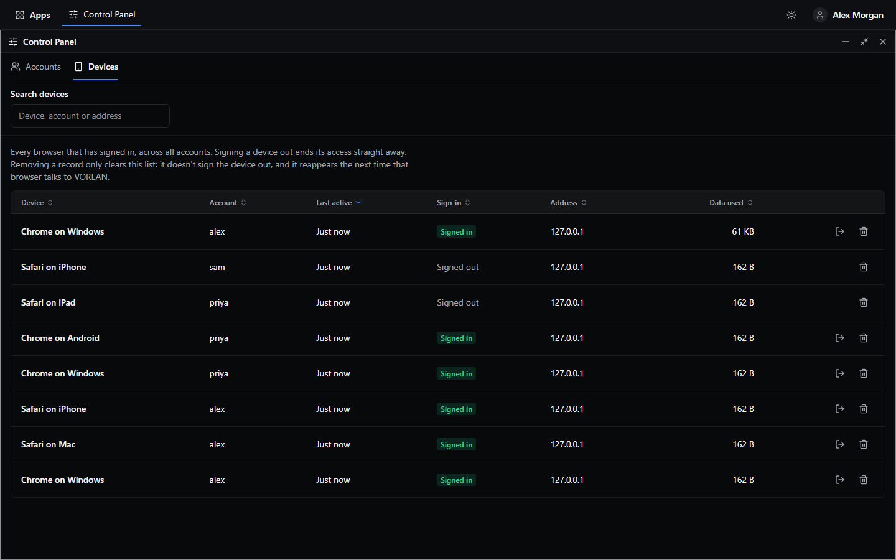<br><b>Control Panel: devices.</b> Every browser and phone that has signed in, whether it still is, and a one-click <i>sign out</i> for any of them.</td>
  </tr>
  <tr>
    <td width="50%">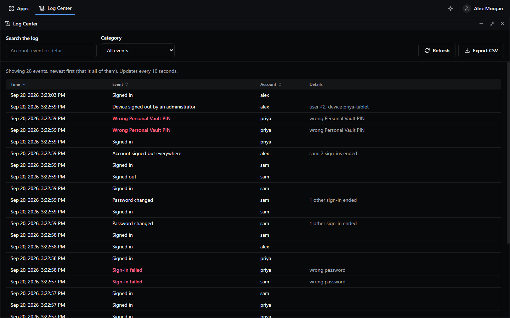<br><b>Log Center.</b> The audit log with search, categories and CSV export. Failed sign-ins, blocked attempts and sign-outs stand out.</td>
    <td width="50%">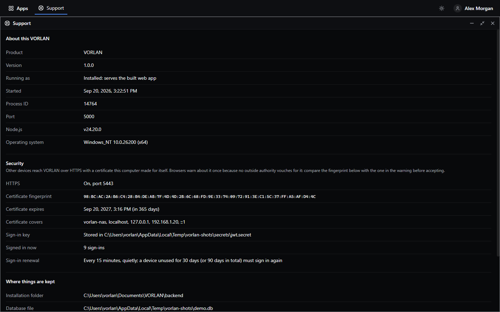<br><b>Support.</b> What this install is and where it keeps things, the <b>Security</b> section (certificate fingerprint and expiry, where the signing key lives) and a diagnostics download to send when something needs help.</td>
  </tr>
</table>

The desktop also has **Task Manager** (running and finished tasks such as file copies), **Services** (API, database, metrics sampler and the assistant, with health and counters) and **Network** (interfaces, live traffic and the addresses other devices should use).

<p align="center">
  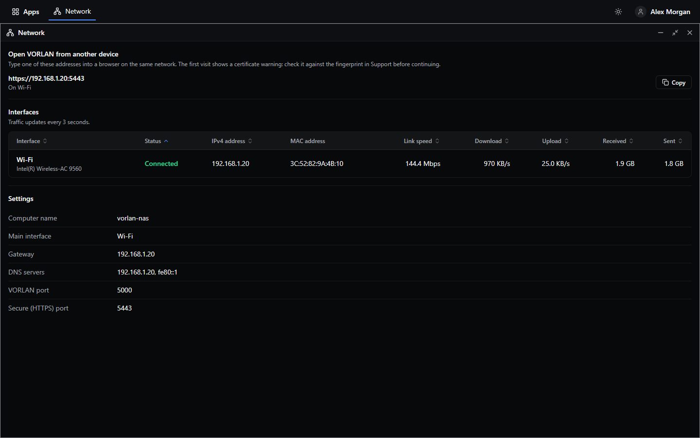
</p>

### Everyone else

<table>
  <tr>
    <td width="50%">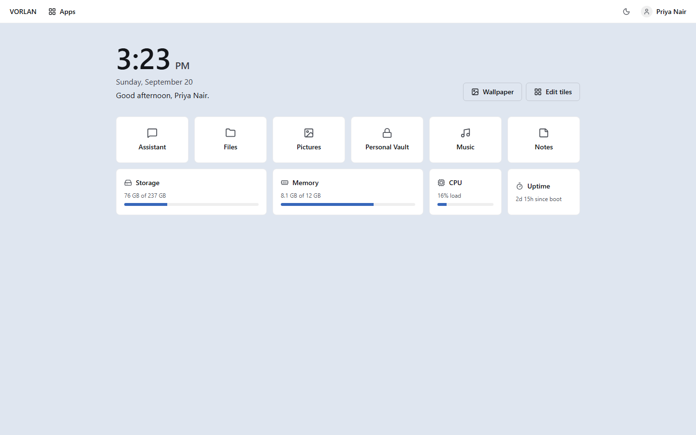<br><b>Home.</b> A clock, a time-of-day greeting, a wallpaper picker and arrangeable tiles. Widgets (storage, memory, CPU, uptime) are opt-in from <i>Edit tiles</i>.</td>
    <td width="50%">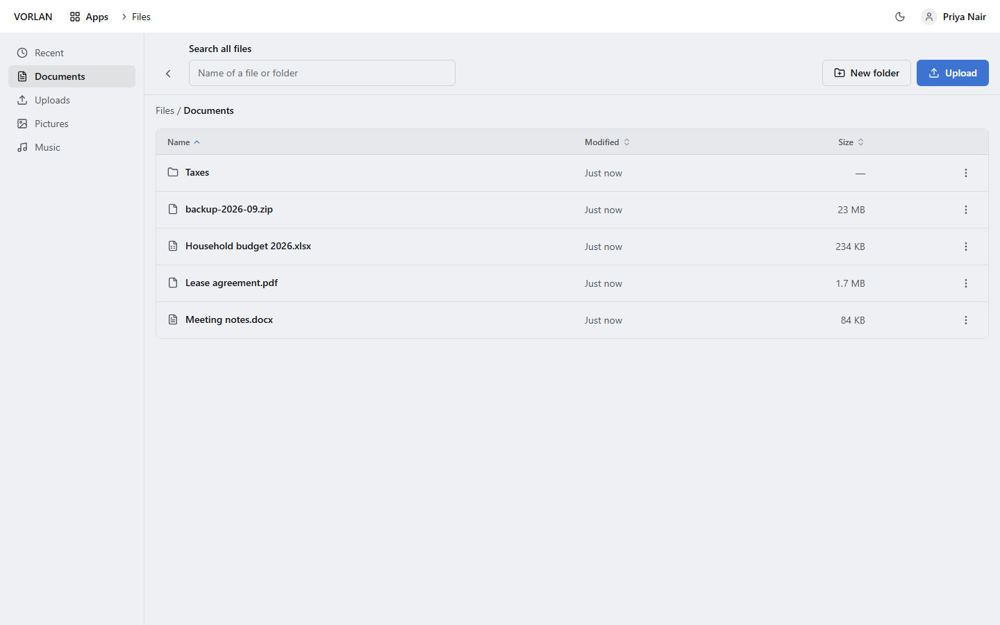<br><b>Files.</b> Documents, Uploads, Pictures and Music, with recent files, search across everything, breadcrumbs, copy, move, rename and upload.</td>
  </tr>
  <tr>
    <td width="50%">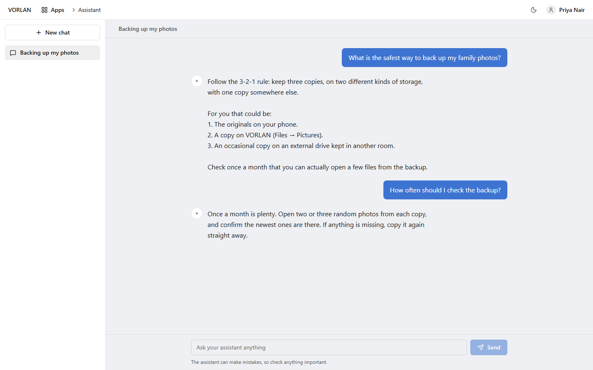<br><b>Assistant.</b> Offline chat with a local model. Answers stream in as they are written, and conversations are saved with automatic titles. Nothing leaves your machine.</td>
    <td width="50%">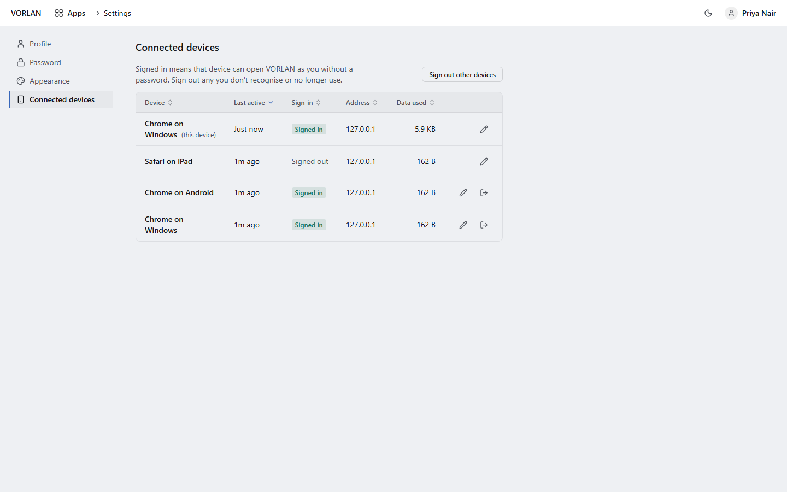<br><b>Settings.</b> Profile, a <b>Password</b> tab, appearance (light and dark, scheduled switching, accent colours) and <b>Connected devices</b>, where you can sign out any device you don't recognise.</td>
  </tr>
</table>

Also in the app: **Pictures** and **Music** (shared media), **Notes** (a rich-text editor, with a private set inside the vault), **Personal Vault** (a private space behind a six-digit PIN) and **Cameras** (point VORLAN at any IP camera's stream URL, for administrators).

### Phones and tablets

Non-admin accounts on a phone or tablet get the original touch-first dashboard.

<table>
  <tr>
    <td align="center" width="25%">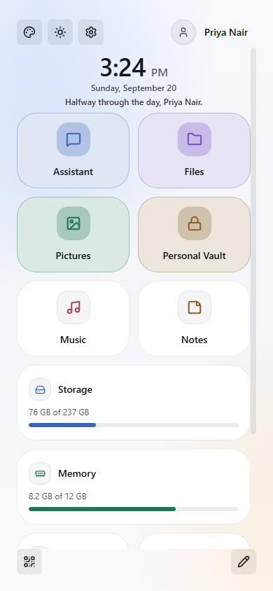<br>Phone home</td>
    <td align="center" width="25%">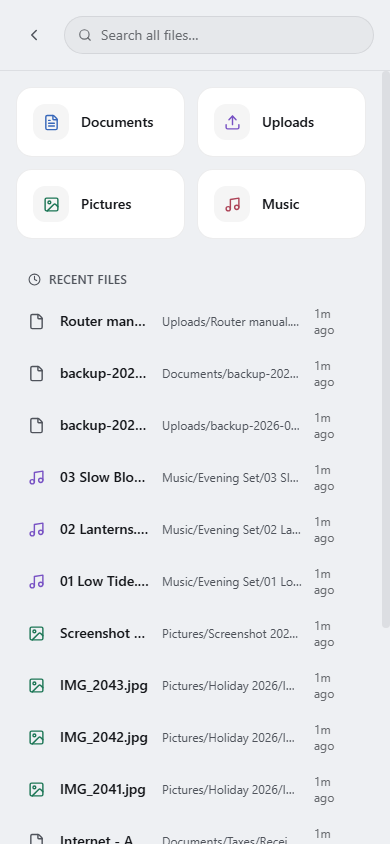<br>Phone files</td>
    <td align="center" width="50%">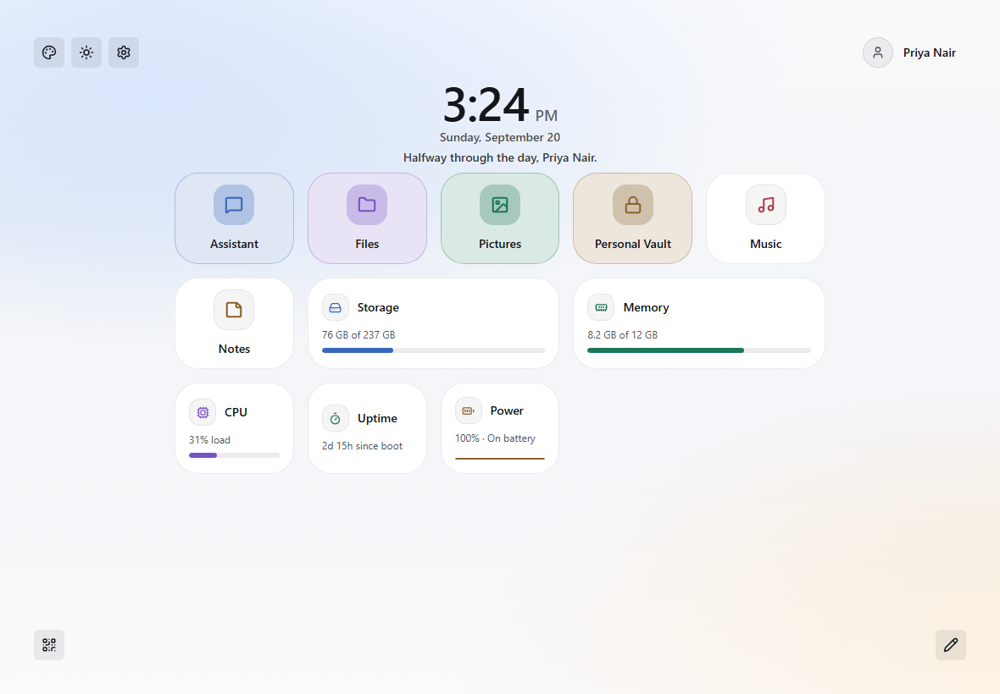<br>Tablet</td>
  </tr>
</table>

The *Connect a phone* item in the account menu shows a QR code that opens VORLAN on the phone without typing an address.

---

## Features

| Area | What it does |
|---|---|
| **Administrator desktop** | Draggable, resizable windows with keyboard control; layouts remembered per user; full-screen windows on phones |
| **Resource Monitor** | Live and 30-day charts for processor, memory, network and disk; process list; system details |
| **Storage Manager** | Volumes and per-folder usage, cached for 30 seconds |
| **Control Panel** | Accounts (create, roles, password reset, delete, sign out everywhere) and devices (see and sign out) |
| **Task Manager** | Running, waiting, finished and failed background tasks |
| **Log Center** | Searchable, filterable audit log with CSV export |
| **Services, Network, Support** | Service health and counters, interfaces and addresses, security summary and diagnostics bundle |
| **Accounts and roles** | Administrator, employee and guest; the first account is the administrator |
| **AI Assistant** | Offline chat backed by a local Ollama model (`phi3`), with history and streaming responses |
| **Files** | Documents, Uploads, Pictures and Music with search, recent files, copy, move, rename and upload |
| **Pictures, Music, Notes** | Shared media and rich-text notes |
| **Personal Vault** | A private, PIN-locked space for your own files and notes, enforced by the server |
| **Cameras** | Live view of any IP camera stream (administrators) |
| **Home** | Wallpaper, clock, greeting and arrangeable tiles with opt-in widgets |
| **Appearance** | Light and dark themes, an automatic schedule and accent colours |
| **Connected devices** | Every device signed in to your account, with one-click sign-out |
| **Phones and tablets** | The original touch-first dashboard for non-admin accounts |
| **Accessibility** | Colour contrast checked against WCAG 2.1 AA, full keyboard navigation, labelled controls, real loading, empty and error states |

---

## Security

- **HTTPS by default.** On first start the backend makes itself a self-signed certificate (covering `localhost`, this computer's name and its LAN addresses) and serves everything on port `5443`. This computer itself can keep using `http://localhost:5000`; any other device that tries the plain address is redirected to HTTPS. Browsers warn about the certificate once per device because no outside authority vouches for it: compare the SHA-256 fingerprint in the warning with the one the server prints on startup (also shown in **Support ▸ Security**) before continuing. Set `VORLAN_TLS=off` to turn it off, or `VORLAN_HTTPS_PORT` to move it.
- **A private sign-in key, generated per install.** The key that signs sessions lives in `backend/secrets/jwt.secret` (created on first start, never committed, readable only by you). To supply your own, set `JWT_SECRET` to at least 32 random characters. Deleting the file signs everyone out and creates a new key.
- **Sessions you can end.** Signing in gives a 15-minute access token that renews itself quietly. Each device has its own session: you can sign it out from **Settings ▸ Connected devices**, an administrator can sign out any device or account, and changing a password signs the account out everywhere else. A device unused for 30 days (or 90 days in total) has to sign in again. A renewal token that is used a second time (for example a stolen copy) ends the whole session.
- **Brute-force limits.** Eight wrong passwords for one account from one address block further attempts for up to ten minutes (forty from one address blocks that address); five wrong Personal Vault PINs block the vault for up to fifteen.
- **Files need a sign-in.** Shared files, downloads and the Personal Vault are only served to signed-in people. The vault also needs its PIN unlocked, and relocks after 15 quiet minutes. Files are opened with a browser-only cookie, so no token ever appears in a URL.
- **Stricter input handling.** Passwords need at least 8 characters, usernames can't contain path characters, file names in delete routes are validated, CORS is closed unless you allow an origin, and every response carries `nosniff`, no-framing and no-referrer headers.

---

## Install on Linux

A one-click installer is available for Fedora and Debian/Ubuntu. It installs Node.js, Ollama (with the `phi3` model) and [linux-wifi-hotspot](https://github.com/lakinduakash/linux-wifi-hotspot) for phone and tablet access, then adds VORLAN to your application menu.

> This repo is currently private, so there's no public download link yet. For now, if you have access to this repo:

```bash
git clone https://github.com/dani4299/VORLAN.git
chmod +x VORLAN/installer/install.sh
./VORLAN/installer/install.sh
```

See [`installer/README.md`](installer/README.md) for details, supported systems, HTTPS notes and troubleshooting.

## Getting started (development)

### Prerequisites

- [Node.js](https://nodejs.org) 18+
- [Ollama](https://ollama.com) installed and running locally, with the `phi3` model pulled:
  ```bash
  ollama pull phi3
  ```

### Install and run

```bash
git clone https://github.com/dani4299/VORLAN.git
cd VORLAN
npm install --prefix backend
npm install --prefix frontend
npm start
```

`npm start` runs the Express backend and the Vite dev server together. By default the backend listens on port `5000` (HTTPS on `5443`) and the frontend on `5173`. Once both are up, open `http://localhost:5173`. The first account you create becomes the administrator.

To reach VORLAN from another device on the same network, use your PC's LAN IP instead of `localhost` (for example `http://192.168.1.11:5173`). The dev server is plain HTTP; an installed copy is served over HTTPS instead.

## Configuration

All optional. Set them as environment variables before starting the backend.

| Variable | Default | What it does |
|---|---|---|
| `PORT` | `5000` | Plain HTTP port (the app on this computer; a redirect to HTTPS for other devices) |
| `VORLAN_HTTPS_PORT` | `5443` | HTTPS port |
| `VORLAN_TLS` | on | Set to `off` to turn HTTPS off |
| `JWT_SECRET` | generated | Your own signing key (32+ characters). Otherwise one is created in `backend/secrets` |
| `VORLAN_SECRETS_DIR` | `backend/secrets` | Where the signing key and certificate are kept |
| `VORLAN_CORS_ORIGINS` | none | Comma-separated origins allowed to call the API from another site |
| `VORLAN_ACCESS_TTL_SECONDS` | `900` | Lifetime of an access token |
| `VORLAN_LOGIN_MAX_FAILURES` | `8` | Wrong passwords per account and address before a lock-out |
| `VORLAN_PIN_MAX_FAILURES` | `5` | Wrong vault PINs before a lock-out |
| `VORLAN_DB_FILE` | `backend/vorlan-secure.db` | Location of the database |

## Tech stack

- **Frontend:** React 19, Vite, React Router, Tailwind CSS, `lucide-react`
- **Backend:** Express 5, SQLite3, short-lived JWT access tokens with rotating refresh tokens, HTTPS with a self-made certificate
- **AI:** [Ollama](https://ollama.com) running the `phi3` model, entirely local
- **Networking:** `nmcli` / NetworkManager for the in-progress device-onboarding feature (Linux only, for now)

## Project structure

```
backend/
  src/
    routes/        API endpoints (auth, admin, explorer, personal, vault, media, ai, ...)
    services/      Business logic: sessions, users, audit log, metrics, job queue, TLS, rate limiting
    middleware/    Sign-in verification, admin check, security headers
    listeners/     Event-bus listeners (audit records, device activity, request stats)
    config/        Paths, constants and the signing-key store
    db/            SQLite connection and schema
frontend/
  src/
    desktop/       The administrator desktop and its window manager
    apps/          The admin windows (Control Panel, Resource Monitor, Log Center, ...)
    pages/         User pages (home, files, assistant, settings, ...)
    components/    The design system (ui), layout, charts and dashboard pieces
    context/       App-wide React state (theme, profile, toasts)
    lib/           API client (sessions, renewal), admin API and small utilities
    legacy/        The original dashboard, kept for phones and tablets
docs/
  screenshots/     The pictures in this README
  superpowers/     Design specs and implementation plans for in-progress work
installer/         The Linux installer
```

## Roadmap

Modelled on the architecture of TrueNAS.

- [x] SQLite data layer, roles, admin API, audit log, metrics, job queue
- [x] Administrator desktop and the redesigned user interface
- [x] Security hardening: HTTPS, private signing key, revocable sessions, rate limits, authenticated files
- [ ] Storage engine (pools, datasets, snapshots)
- [ ] App registry
- [ ] System service lifecycle (systemd)
- [ ] SMB and NFS sharing
- [ ] QR-based device onboarding, including a hotspot that runs alongside your regular Wi-Fi. Design work is in [`docs/superpowers/`](docs/superpowers)

## License

No license has been chosen for this project yet.
